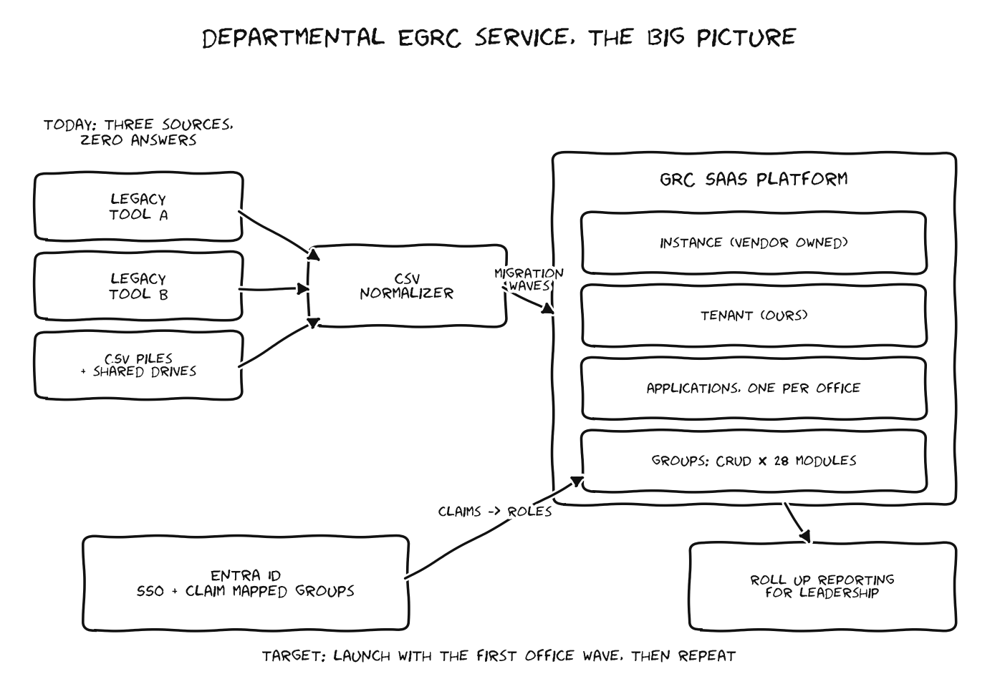

# Solution Architecture: Departmental EGRC Service



## The current state, honestly

Today the department answers data calls by hand. One office keeps its accreditation records in one legacy GRC tool, another office lives in a different one, and a surprising number of program offices run their entire security posture out of CSV files and shared drives. When headquarters asks a question like "how many systems have expired ATOs," somebody spends a week stitching spreadsheets together, and the answer is stale before it ships.

## The target state

One departmental GRC service on a SaaS platform. The vendor owns the instance layer and the infrastructure underneath it. We come in at the tenant layer as tenant administrators. Inside the tenant, each site or program office gets an application, which is basically a container holding that office's systems, artifacts, controls, and POA&Ms.

The layer cake looks like this:

```
Instance        vendor owned, SaaS
  Tenant        ours, tenant admins live here
    Application one per site / program office
      Groups    permission sets, CRUD across ~28 modules
        Users   authenticated through Entra ID via SSO claim mapping
```

## Design principles I am holding to

**Treat the platform as fluid.** The vendor is shipping a parent child hierarchy and permission inheritance model mid development. Anything we build against the current flat application model has to survive that change. That is why the permission templater keys off module IDs discovered at runtime rather than hardcoded maps, and why the RBAC design doc has a section on what changes when inheritance lands.

**Never require console clicking for a repeatable task.** Manual work in the GUI is fine for one offs. Group creation, permission assignment, and claim mapping happen hundreds of times, so they get automation with a dry run mode and a review step.

**The Entra team owns Entra.** We do not ask for write access to the directory. We generate change request packages they can review, approve, and apply with their own tooling. The provisioner produces exactly that.

**Separate mission requirements from local preference.** Every program office wants things their way, and the truth is you cannot make everyone happy. What you can do is set up a clear intake and governance process: listen to their current workflow, look at the standard procedures they actually have in place, capture the must haves, then separate the true mission or compliance needs from local preference and map them back to the departmental standard. Everyone gets heard, and the decision rationale stays visible.

## Integration posture

Everything brought into the platform so far has been flat file CSV import. That is fine for migration but it is not a service. The near term integration order I would argue for:

1. Entra ID SSO with claim mapped groups (exists, needs the scaling work in this repo)
2. Programmatic group and permission management through the platform API (this repo)
3. Scanner ingest, so vulnerability data lands on systems automatically instead of by CSV
4. Upstream reporting feeds, once the hierarchy model ships and the data segregation question is settled

## What launch actually requires

Launch does not require solving everything. It requires the MVP: the first office migrated, SOPs and training in place, and an O&M runway so the team that inherits the service is not handed a pile. The migration runbook in this repo is scoped to exactly that, and everything longer term is sequenced into sustainment.
