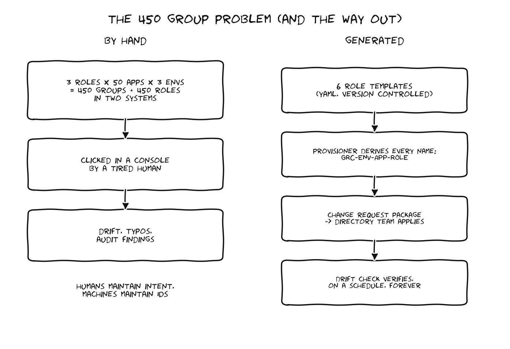

# RBAC Design: From 450 Hand Managed Groups to a Generated System



## The math that makes this a problem

Start with the simplest possible model: three roles per application. Admin, executive read only, standard user.

| | Count |
|---|---|
| Applications (sites and program offices) | 50 |
| Roles per application (floor) | 3 |
| Entra groups per environment | 150 |
| Entra app roles for claim mapping per environment | 150 |
| Environments | 3 |
| **Total Entra objects to create and manage** | **900** |
| Plus the same groups again inside the platform | 450 |

And three roles is the floor, not the design. Real offices need an ISSO role, an assessor role, an auditor read only role. At six roles per application the Entra object count crosses 1,800. Nobody manages that by hand without drift, and drift in an access control system for an accredited GRC platform is a finding waiting to happen.

## Naming convention

Every generated object follows one pattern, so a human can read any group name and know exactly what it grants:

```
GRC-{ENV}-{APP}-{ROLE}

GRC-PROD-SITE-ALPHA-ADMIN
GRC-TEST-HQ-OCIO-EXEC-RO
GRC-DEV-SITE-BRAVO-ISSO
```

The provisioner enforces this. Names are never typed, they are derived. That single decision removes the largest source of claim mapping bugs, which is a group name and a role name disagreeing by one character.

## Role catalog

Defined once in `templates/permission-templates.yaml`, applied everywhere by the templater:

| Role | Intent | Module access pattern |
|---|---|---|
| ADMIN | Application administrator | Full CRUD on all modules in own application |
| EXEC-RO | Leadership visibility | Read on all modules, no writes anywhere |
| USER | Working analyst | CRUD on artifacts and POA&Ms, read on the rest |
| ISSO | System owner duties | CRUD on controls, artifacts, POA&Ms, read elsewhere |
| ASSESSOR | Independent assessment | Read everywhere, update on assessment modules only |
| AUDITOR | External review | Read only, time boxed membership |

The templates express intent ("full CRUD on all modules"). The templater resolves intent into the per group, per module unique IDs the platform actually requires. That separation is the whole trick: humans maintain six readable templates, the machine maintains thousands of module permission entries.

## The claim mapping flow

```
User signs in through Entra SSO
  -> Entra token carries app role claims from group membership
  -> Platform maps claims to its internal groups
  -> Internal group carries the CRUD permission set applied by the templater
```

Two systems have to agree for this to work, which is why the provisioner ships a drift command. It reads what the platform side expects and what the directory side has, and reports mismatches before a user does.

## Working with the Entra team, not around them

The Entra team will not give us write access to the directory, and they are right not to. The provisioner therefore produces a change request package: a CSV and JSON manifest of exactly the groups and app roles to create, named per convention, with a human readable summary on top. They review it, they apply it with their tooling, we verify with the drift check. Everyone keeps their swim lane and there is a paper trail for the accreditation evidence.

## What changes when the vendor ships hierarchy and inheritance

The vendor's parent child application model with permission inheritance is on the near term roadmap. When it lands:

1. Program office executives get read only inheritance into child site applications. That removes the need for many of the cross application EXEC-RO memberships, so the group count should go down, not up.
2. The role catalog gains a scoping dimension (this role, at this node, inherited how far down). The templates are structured with a `scope` field already so the change is additive.
3. Roll up reporting starts flowing through the hierarchy, which reopens the data segregation design. That interaction is covered in the segregation decision paper, doc 03.

Designing for a moving platform means betting on the parts that will not change: names, intent based templates, and a review before apply workflow. Those survive any vendor roadmap.
