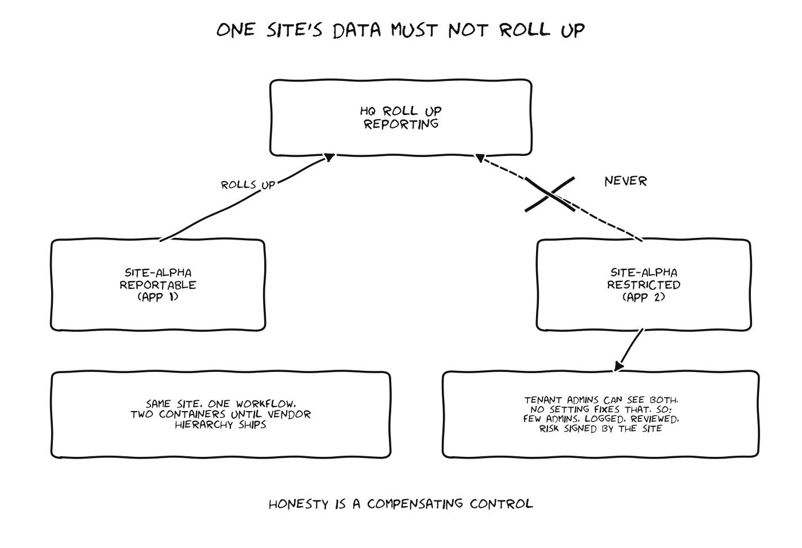

# Decision Paper: Segregating Site Data That Must Not Roll Up

**Audience:** CISO / OCIO leadership. **Ask:** pick an option by the next governance board. **My recommendation:** Option 2 now, Option 3 when the vendor ships hierarchy.

## The situation in three sentences

One site needs to manage all of its data in the departmental GRC tool, but a portion of that data must not be visible in headquarters roll up reporting. The platform's current reporting cannot reach into a site and pull only half of its information, and tenant administrators, who sit at headquarters, can by design see everything in the tenant. There is no configuration setting that removes tenant admin visibility, so any answer here is part technical control and part governance decision that leadership needs to make with eyes open.

## What we cannot do

Be straight about this first. We cannot technically prevent a tenant admin from viewing data inside the tenant. That is the SaaS operating model: vendor owns the instance, we own the tenant, tenant admins have tenant wide rights. The truth is there is no setting that fixes this, and anyone who says otherwise has not read the admin model.

## Options

**Option 1: Keep the sensitive slice out of the tool.**
The site manages its reportable data in the platform and keeps the non reportable slice in its local process.
Good: zero visibility risk. Bad: kills the whole point of a single tool for that site, recreates the CSV problem we were hired to end, guarantees the site's adoption fails.
Residual risk: low technical, high mission.

**Option 2: Two applications for the site, plus admin governance. (Recommended now)**
Split the site into two containers: `SITE-REPORTABLE` and `SITE-RESTRICTED`. Roll up reporting is pointed only at the reportable application. The restricted application gets its own groups per the standard role catalog, no cross memberships. For the tenant admin exposure, wrap compensating controls around the people instead of the software: a documented rule of behavior for tenant admins, membership kept to a named handful, audit log review of admin access to the restricted application on a set cadence, and the site signs the risk acceptance so the exposure is owned, not discovered.
Good: works with the platform as it exists today, auditable, honest.
Bad: the site maintains two containers until inheritance ships, some duplicate admin work.
Residual risk: moderate and documented, which is the best available today.

**Option 3: Vendor parent child hierarchy with selective roll up. (When it ships)**
The vendor's hierarchy model plus inheritance is on the roadmap. When it lands, restructure the site as a parent with reportable and restricted children, and let the hierarchy handle scoped roll up natively. Option 2 converts cleanly into this because the data is already split along the right boundary.
Good: the long term right answer. Bad: does not exist yet, and vendor dates slip, so we do not plan launch around it.

**Option 4: Push the vendor for a tenant admin scoping feature.**
Raise it through the product roadmap channel as a multi tenant government requirement. Worth doing in parallel regardless of the option chosen. Do not plan launch around it.

## Recommendation

Adopt Option 2 for launch. Design the application split so it maps one to one onto the Option 3 hierarchy when the vendor delivers. File the Option 4 feature request now with the departmental requirement attached. Bring the tenant admin risk acceptance to the site and to the CISO as a signed artifact, because the moment that site realizes a headquarters admin can see their restricted data, the conversation goes political, and the difference between a crisis and a footnote is whether we told them first.
