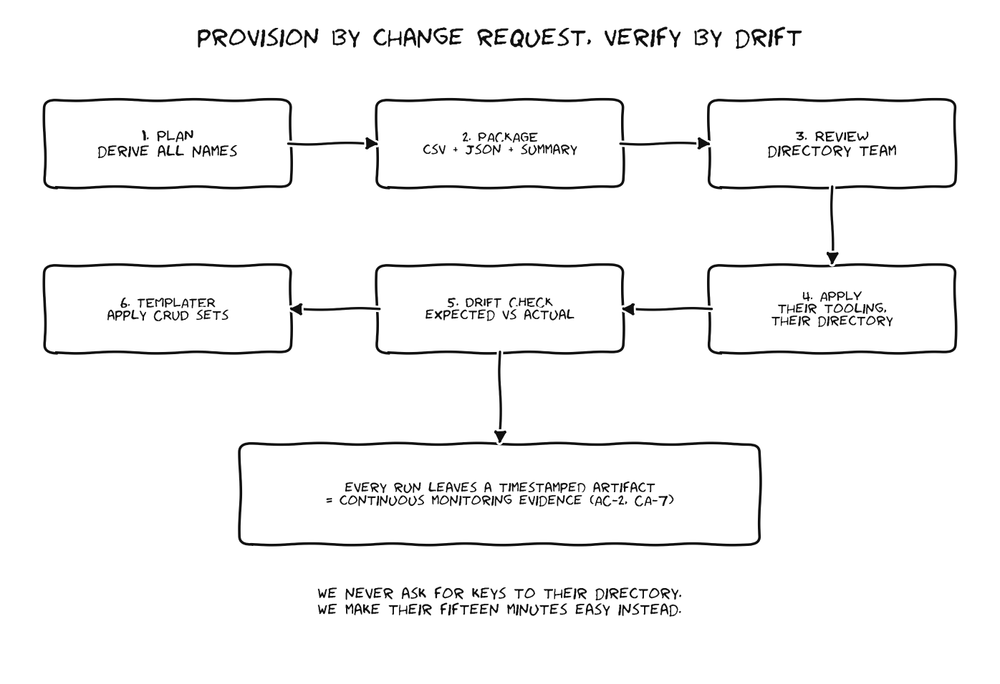

# Entra Sync Design: Provision by Change Request, Verify by Drift Check



## The constraint that shapes everything

We do not administer Entra. A separate directory team does, and they are never going to hand tenant write permissions to an application team. If I were them I would refuse too, that is literally their job. So the design goal is not "automate Entra." It is "make the directory team's part of this take fifteen minutes instead of a week, with zero ambiguity about what we are asking for."

## The workflow

```
1. PLAN      provisioner generates every group + app role name
             from the app list, role catalog, and environments

2. PACKAGE   emits a change request bundle:
             - summary.md   human readable, what and why
             - groups.csv   one row per group to create
             - approles.json  claim mapping definitions

3. REVIEW    directory team reviews, applies with their own tooling
             (they keep their process, we keep our paper trail)

4. VERIFY    provisioner drift command compares platform side
             expectations against a directory export and reports:
             missing, unexpected, misnamed

5. APPLY     templater applies permission templates to the
             platform side groups, dry run first, always
```

## Why not direct Graph API writes?

The provisioner includes a Graph client stub and could write directly with an app registration. I built the change request path as the default anyway, for three reasons. First, the political reality above. Second, separation of duties reads better in an accreditation package than a service principal with Group.ReadWrite.All. Third, a reviewed CSV of 450 group creations catches naming disasters before they exist, and deleting 450 misnamed groups from a production directory is a bad Tuesday.

If the directory team later decides they want to delegate a scoped administrative unit to us, the same plan output feeds the Graph client and nothing else changes. The design keeps that door open without depending on it.

## Drift as a continuous monitoring control

The drift check is not a one time migration tool. Run on a schedule, it becomes evidence for the access control family: proof that the deployed group topology still matches the approved design. Every run is timestamped and diffable, which turns "review access control configuration" from an annual scramble into a standing artifact. The control mapping doc ties this to the specific 800-53 controls.

## Scale numbers, so nobody is surprised later

| Model | Groups + roles per env | All three envs |
|---|---|---|
| 3 roles x 50 apps (launch floor) | 300 | 900 |
| 6 roles x 50 apps (realistic) | 600 | 1,800 |
| 6 roles x 50 apps + restricted app splits | 612+ | 1,836+ |

These numbers are why "we will just manage it in the console" is not a plan. They are also why the naming convention is enforced by code rather than by a wiki page asking people nicely.
